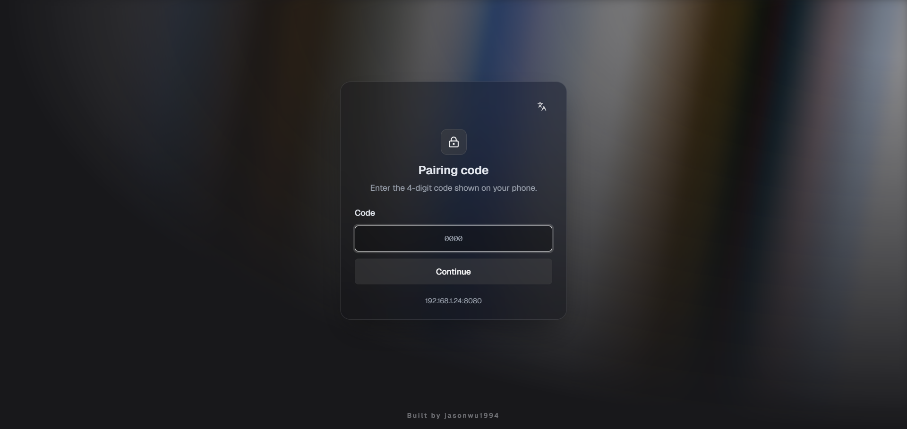
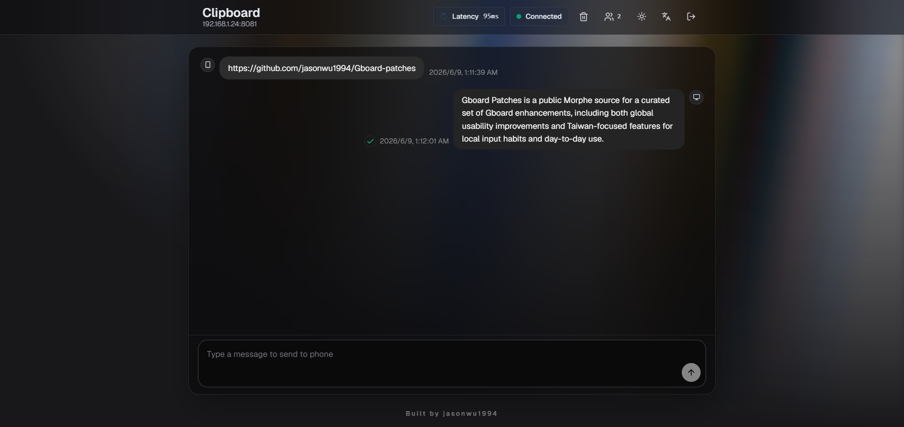

<h1 align="center">LuckyBoard</h1>

<p align="center">
  Morphe patches for Gboard, rebranded as LuckyBoard with practical upgrades and experimental features for global users.
</p>

<p align="center">
  <a href="https://github.com/jigs4wkiller/LuckyBoard/releases/latest"></a>
  <a href="https://github.com/jigs4wkiller/LuckyBoard"></a>
  <a href="https://morphe.software/add-source?github=jigs4wkiller/LuckyBoard"></a>
  <a href="https://github.com/jigs4wkiller/LuckyBoard"></a>
</p>

---

## Overview

LuckyBoard is a public Morphe source (fork of Gboard-patches) providing curated enhancements for Gboard. It includes full rebranding to LuckyBoard (package name, app label, and UI strings), complete removal of China/region-specific features, and a wide range of usability + experimental improvements. All patch descriptions and UI are in clean English.

The patched app installs side-by-side with official Gboard as "LuckyBoard". Many advanced/experimental features (especially flags) can be controlled at runtime from inside Gboard via the injected "Feature Flags" section in the Patches/LuckyBoard settings. Flags included via the patch start disabled by default — users must enable the ones they want directly in the app.

## Key Highlights

- **Full rebranding** — Package, app name, and strings replaced with LuckyBoard
- **China/region cleanup** — Removed region-specific entries and symbols
- **Runtime control** — Most experimental features (including all flags) can be toggled inside the app
- **Clean English** — No Chinese text anywhere in patches or UI
- **19 patches** — Including incognito enhancements, custom key shapes, web clipboard, and more

## Included Patches

LuckyBoard includes rebranding (package, app label, and in-app strings), removal of region-specific features, and many usability/experimental enhancements. Most experimental features can be controlled at runtime via an in-app "Feature Flags" section in the settings (injected when enabled).

### Rebranding & Core

<details>
  <summary><code>Add Gboard Signature Bypass</code></summary>

  Bypasses Gboard signature whitelist checks.
</details>

<details>
  <summary><code>Package Rename</code></summary>

  Renames the package to <code>dev.lucky.com.google.android.inputmethod.latin</code> for side-by-side installation with official Gboard and renames the app to "LuckyBoard".
</details>

<details>
  <summary><code>Replace Gboard with LuckyBoard</code></summary>

  During patching, replaces occurrences of "Gboard" with "LuckyBoard" in resources and strings so the patched app uses LuckyBoard branding throughout the UI.
</details>

### Global Usability & Input

<details>
  <summary><code>Clipboard Enhancements</code></summary>

  Enhance clipboard retention time, item count limits, preview lines, countdown/creation-time labels, order index, and grid columns. Use the gear icon for per-feature options (selective activation).
</details>

<details>
  <summary><code>Custom Symbols</code></summary>

  Adds a dedicated symbols tab and a quick access entry from the comma long-press popup (China-specific symbols removed).
</details>

<details>
  <summary><code>Emojis, stickers &amp; GIFs Tab Order</code></summary>

  Customize the bottom tab order in the emojis/stickers/GIFs panel with drag-and-drop reordering.
</details>

<details>
  <summary><code>Enable Undo/Redo feature</code></summary>

  Enables Gboard's Undo and Redo entry points.
</details>

<details>
  <summary><code>English QWERTY Slide Symbols</code></summary>

  On the English QWERTY keyboard, swipe down to enter symbols and swipe up to quickly enter letters in uppercase or lowercase without switching layers.
</details>

<details>
  <summary><code>Web Clipboard</code></summary>

  Hosts a phone-powered Web Clipboard portal that lets desktop browsers sync with Gboard over the same LAN, with a pairing code gate and an optional Quick Settings Tile.

  Preview:
  

  
</details>

### Experimental & Rollout Flags

These can be individually enabled at patch time. When the "Add flags to Lucky Settings" option is active they also appear as runtime toggles inside the app.

<details>
  <summary><code>Clipboard Entity Extraction</code></summary>

  Enables Clipboard settings that show information extracted from recently copied text, such as addresses, phone numbers, and similar items.
</details>

<details>
  <summary><code>Clipboard Item Edit</code></summary>

  Enables the <code>Edit</code> action when long-pressing a clipboard item.
</details>

<details>
  <summary><code>Feature Flags</code></summary>

  Master patch exposing many internal/rollout/experimental flags as individual toggles (gear icon in Morphe). Includes support for accessory/floating keyboard, voice widgets, OCR/scan text, dictation UI redesign, two-pane settings, improved language search, collapse button, and more.

  Top option "Add flags to Lucky Settings": When enabled, injects a "Feature Flags" section directly into the settings (LuckyBoard / Patches area). There, each flag has a title + short description and a runtime on/off switch. Flags start disabled by default — the user must explicitly enable the ones they want inside the app. Research based on Rboard, GMS-Flags, and phenotype mod communities for the supported build.
</details>

<details>
  <summary><code>Grammar Checker</code></summary>

  Enables the <code>Text correction &gt; Grammar check</code> setting and its related rollout gate.
</details>

<details>
  <summary><code>Inline Suggestions</code></summary>

  Enables the <code>Text correction &gt; Smart Compose</code> setting and its related rollout gate.
</details>

<details>
  <summary><code>Key Shape Selection</code></summary>

  Enables the <code>Key shape</code> option inside theme details + extended gradations: less rounded (subtle curve), horizontal lines style (as a step toward fully flat design), plus the rounded set (light/medium/strong/very strong/pill).
</details>

### Settings & Other

<details>
  <summary><code>Incognito Enhancements</code></summary>

  Enable clipboard and voice typing in incognito mode. Also force Gboard to always open in incognito mode to disable typing history collection and personalization. (Ported from Adobo patches by jkennethcarino)
</details>

<details>
  <summary><code>Latin Globe Key Ignore Interval</code></summary>

  Add an independent globe key ignore interval override for post-typing language-switch delay (Latin layouts).
</details>

<details>
  <summary><code>Settings Clean-Up</code></summary>

  Removes the following from Gboard's settings: Help & Feedback, Info, Rate, and Privacy categories.
  For the Privacy category, all usage statistics / diagnostics / crash reporting / sharing sub-options are first turned off before the category entry itself is hidden.
</details>

<details>
  <summary><code>Settings Homepage Override</code></summary>

  Lets you switch between the new and legacy Gboard settings homepage styles.
</details>

## In-App Feature Flags (Runtime Control)

When the **Feature Flags** patch + "Add flags to Lucky Settings" option is enabled, a clean **Feature Flags** screen appears under Patches / LuckyBoard in the app settings.

- All selected flags start **disabled**.
- Toggle them on directly inside LuckyBoard.
- Many changes (especially shapes, incognito, voice) require a full restart of the app (button provided in the screen).
- The in-app menu now uses consistent LuckyBoard branding.

## Installation

Add this repository as a Morphe source:

- [Open in Morphe](https://morphe.software/add-source?github=jigs4wkiller/LuckyBoard)
- Or manually add `https://github.com/jigs4wkiller/LuckyBoard`

Pre-built `.mpp` bundles are available in the GitHub Releases. You can also use the raw `patches-list.json` / `patches-bundle.json` for direct linking in Morphe.

## Building from Source

Before running Gradle locally, authenticate to Morphe's GitHub Packages registry with either:

- `gpr.user` and `gpr.key` in `~/.gradle/gradle.properties`
- `GITHUB_ACTOR` and `GITHUB_TOKEN` as environment variables

Build the Android patch bundle:

```powershell
.\gradlew.bat :patches:buildAndroid
```

Regenerate patch metadata (updates `patches-list.json` and `patches-bundle.json`):

```powershell
.\gradlew.bat generatePatchesList
```

Generated outputs:

- `patches/build/libs/*.mpp`
- `patches-list.json`
- `patches-bundle.json`

## Credits

- Incognito Enhancements patch (Enable clipboard in incognito, Enable voice typing in incognito, Always-incognito mode) ported from [Adobo by jkennethcarino](https://github.com/jkennethcarino/adobo).

## License

Released under the [GNU General Public License v3.0](LICENSE).
